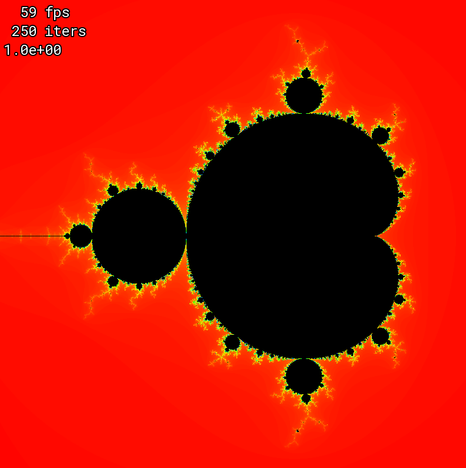
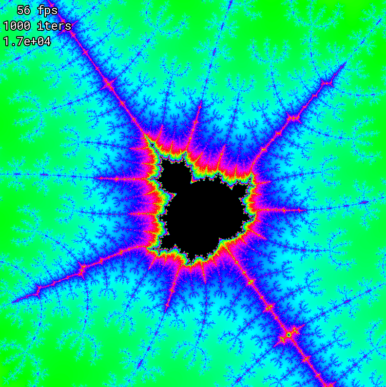

# mandelbrot

SFML-based Mandelbrot viewer program.

<p float="middle">
    
    
</p>

# Requirements
 * C++17
 * CMake 3.22

# Building & Running

```
cmake -B build -DCMAKE_BUILD_TYPE=Release
cmake --build build --config Release --target run
```

# Controls

| Action            | Control         |
| ----------------- | --------------- |
| Go to point       | Click           |
| Zoom              | Scroll (or W/S) |
| Pan               | Arrow keys      |
| Change iterations | [ and ]         |
| Reset view        | R               |
