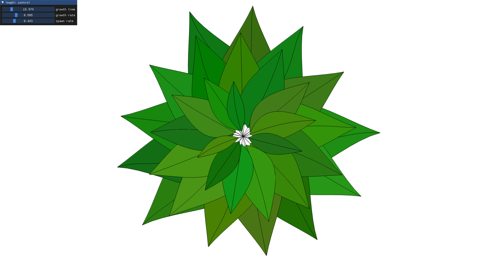

# LeaPHI

Striking discoveries can be made when analyzing growth patterns of various plants.
For example, many develop a set of five or eight spirals depending on counting direction.
These emerge from the rule by which new parts branch off of the main structure: the golden ratio *phi*.

In this project my goal was to devise a method for leaf and growth pattern generation based on *phi*.
For the result to look **natural and organic**, a number of basic considerations were made:

- For a smooth and characteristic contour, the leafs are generated from a custom setup of **cubic Bézier curves**, that is controlled by a growth-stage factor and a random seed.
The latter effects the course of the leaf's primary vein to add variation between leafs, while the growth-stage determines the size by how far this vein is evaluated and shifts contour proportions.
For the stem generation a section of the inverted vein is used to assure a continuous transition.
- The resulting 1-dimensional mesh of every leaf is than filled with a constrained Delaunay triangulation via [Shewchuk's Triangle library](https://www.cs.cmu.edu/~quake/triangle.html) and colored in a dim green with some red, once again based on a random seed for variation.
- Finally, a set of leafs is arranged around a common center and animated along a timeline, which is controlled by a growth rate and leaf spawn rate.
To account for a natural growth progression, the growth-stage factor is adjusted with the **decadic logarithm**.
Thus, leafs grow ever slower the bigger they get.

Because every step of the generation is rooted in a parametric model, the resulting growth animation is smooth and thanks to the above mentioned considerations and the golden ratio *phi*, it looks natural and organic.

**Dependencies:**

- CMake
- OpenGL + GLEW + GLM
- [GLFW3](https://www.glfw.org/)

**Build:**

- ./run cmake
- ./run make
- ./run

## Results

First results:

After some tweaking:

//TODO Animation
