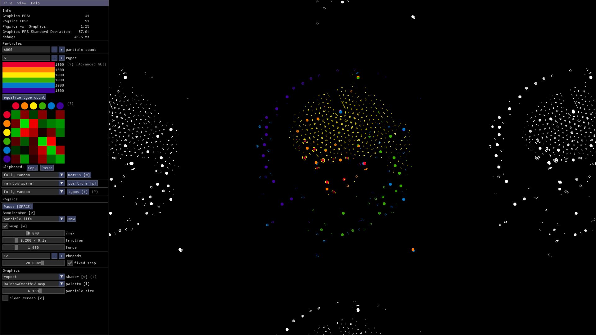

# 🦠 Particle Life App

A GUI for the Particle Life Framework.



## How to build this app from source

For this, you need to have [Git](https://git-scm.com/downloads) and [Java](https://jdk.java.net/19/) with version 16 or higher installed on your computer. Confirm your Java version with `java -version`.

Then, execute these lines in the terminal:

```sh
./gradlew run
```

<!-- ## How to make a release

- Confirm that everything is working correctly and check in with others that the current state of the main branch is ready for release.
- Run `./gradlew zipApp` from the project root.
  This generates the zip file `particle-life-app.zip` in `./build/zipApp/`. It includes the Windows executable (`.exe`) along with other files.
- Go to the [Releases](https://github.com/tom-mohr/particle-life-app/releases) section of this GitHub repo and click `Draft a new release`.
- Click `Choose a tag` and type the new version name:
  - Prefix the version name with the letter `v`. Some good tag names might be `v1.0.0` or `v2.3.4`.
  - The version name should comply with [semantic versioning](https://semver.org/). Talk to others if you are unsure about what to choose here.
- Click `Create a new tag`.
- Set the release title to match the tag name.
- Use the description to summarize the changes of all commits since the last release.
- Add the generated `particle-life-app.zip` as an asset to the release.
- Click `Publish release`. -->
