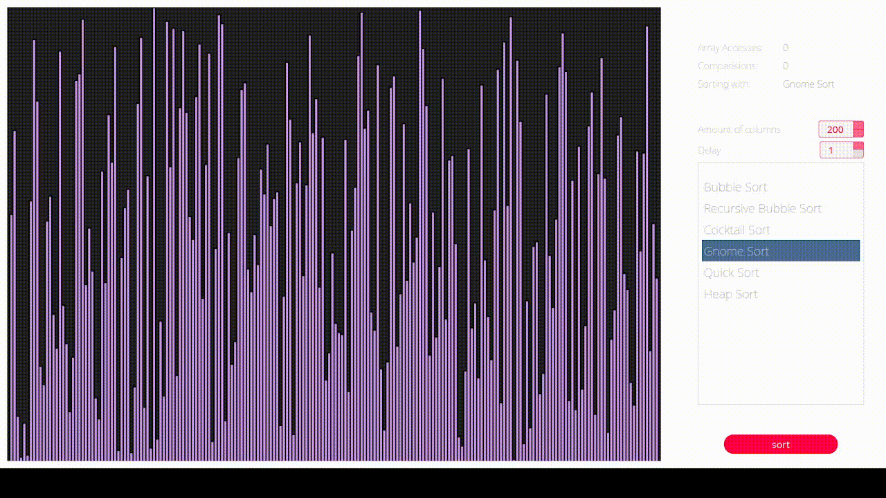
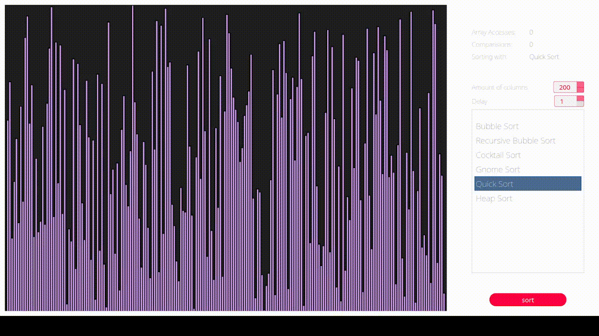
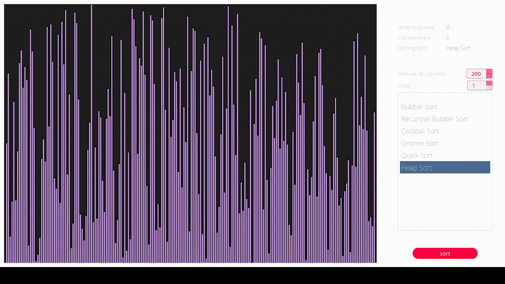

# Sorting algorithms visualization

**Visualization of sorting algorithms**
**Visualize the most popular algorithms on your desktop screen**

## About
  The app visualizes the sorting process of the most popular sorting algorithms. It generates a defined number of columns in the shape of a right-angled triangle and mixes them up. On the start button click, the chosen algorithm is sorting columns by ascending height.

## Instruction Compile
```shell
qmake
make
./find
```

  <h5><b>Usage</b></h5>
  <ul>
    <li><strong>select</strong> sorting algorithm which you would like to see in the action</li>
    <li>(optional) <strong>specify</strong> amount of columns and delay (ms)</li>
  </ul>
</div>

<div align="center">
  <h5><b>Examples</b></h5>
  <p>Here's some preview of sorting algorithms in action.</p>

  <table>
    <tr>
      <td align="center">
        <strong>Bubble Sort - 200 columns 1 ms</strong>
        <br />
        
      </td>
      <td align="center">
        <strong>Recursive Bubble Sort - 200 columns 1 ms</strong>
        <br />
        
      </td>
    </tr>
    <tr>
      <td align="center">
        <strong>Cocktail Sort - 200 columns 1 ms</strong>
        <br />
        
      </td>
      <td align="center">
        <strong>Gnome Sort - 200 columns 1 ms</strong>
        <br />
        
      </td>
    </tr>
    <tr>
      <td align="center">
        <strong>Quick Sort - 200 columns 1 ms</strong>
        <br />
        
      </td>
      <td align="center">
        <strong>Heap Sort - 200 columns 1 ms</strong>
        <br />
        
      </td>
    </tr>
  </table>
</div>
