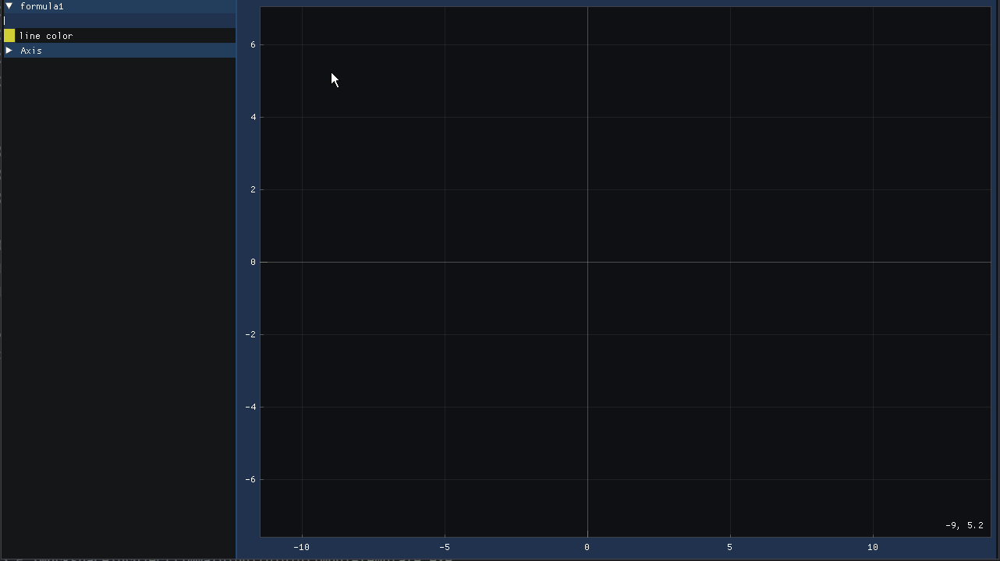

import GroupName from '../../../components/GroupName.astro'
import { Tabs, TabItem } from '@astrojs/starlight/components';
import { Aside } from '@astrojs/starlight/components'
import { Steps } from '@astrojs/starlight/components'

<GroupName>Equations Field</GroupName>


# Equa Plot

A simple math plotter using ImGui for the user interface and ImPlot for visualizing mathematical functions. 

It allows the user to input mathematical formulas, adjust axis ranges, and visualize the function's graph in real-time.

## How it works
<ul>
<li> - Initializes a GLFW window with OpenGL context.</li>
<li> - Loads ImGui and ImPlot for creating a graphical interface.</li>
<li> - Accepts user input for a mathematical expression and plots the function.</li>
<li> - Provides interactive controls for adjusting the plot's axis ranges.</li>
<li> - Dynamically updates the plot based on the formula entered by the user.</li>
</ul>

<br/>
import { Badge } from '@astrojs/starlight/components';

<Badge text="Note:" variant="note" /> The program also features the use of the exprtk library for parsing and evaluating mathematical expressions. 
    It allows users to input custom formulas for plotting.

### Screenshot



## Usage

<Steps>

1. Install libraries and dependencies with conan
    <Tabs>
    <TabItem label="Already Built">
    ```
    conan install .. --output-folder=.
    ```
    </TabItem>
    <TabItem label="If not">
    ```
    conan install .. --output-folder=. --build=missing
    ```
    </TabItem>
    </Tabs>

2. Enter the build directory
    ```
    cd build
    ```
    
3. Compile the cmake libraries with conan.cmake toolchain.
    ```
    cmake ..
    ```
4. Compile the main.cpp with dependencies.
    ```
    cmake --build .
    ```
</Steps>


### Libraries

In the conan file.
