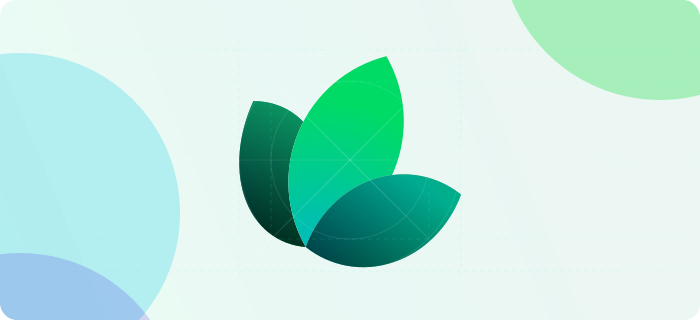

import GroupName from '../../../components/GroupName.astro'
import ArticleSection from '../../../components/ArticleSection.astro'
import { Card, CardGrid } from '../../../components/components'

<GroupName>Getting Started</GroupName>

# Introduction

Mathematics serves as the cornerstone of programming, enabling developers to solve complex problems, design efficient algorithms, optimize performance, and create aesthetically pleasing applications. Essential mathematical concepts for programming include logic, sets, functions, relations, graphs, matrices, calculus, discrete mathematics, and cryptography.



## Technologies used

<p align="center">
  <a href="https://skillicons.dev">
    
  </a>
</p>

## OS that can run on

<p align="center">
  <a href="https://skillicons.dev">
    
  </a>
</p>

## Mathematical Concepts in Programming


<ArticleSection>
### Functions
Functions are reusable blocks of code that perform specific tasks. They help in breaking down complex problems into manageable pieces.

```python
def greet(name):
    return f"Hello, {name}!"
print(greet("Alice"))
```
</ArticleSection>

<ArticleSection>
### Graphs
Graphs are used to represent relationships between objects. They are fundamental in various algorithms and data structures.
```c++
#include <bits/stdc++.h>
using namespace std;

int main() {
    // Create a graph using adjacency list
    int vertices = 5;
    vector<vector<int>> adjList(vertices);

    // Adding edges
    adjList[0].push_back(1);
    adjList[0].push_back(2);
    adjList[1].push_back(3);
    adjList[2].push_back(4);

    // Display the adjacency list
    for(int i = 0; i < vertices; ++i){
        cout << "Vertex " << i << ": ";
        for(auto &v : adjList[i]){
            cout << v << " ";
        }
        cout << endl;
    }
    return 0;
}
```
</ArticleSection>


